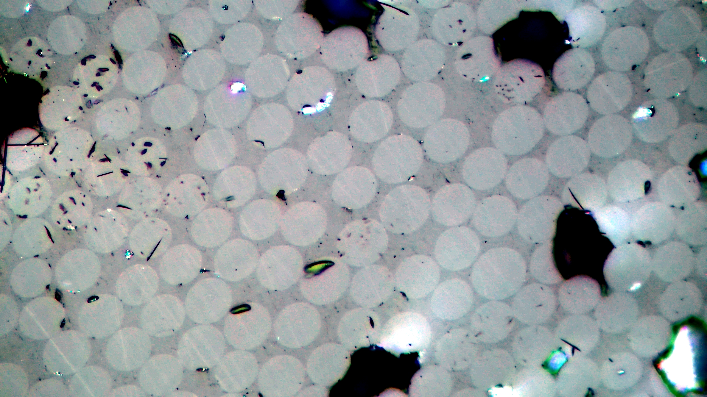
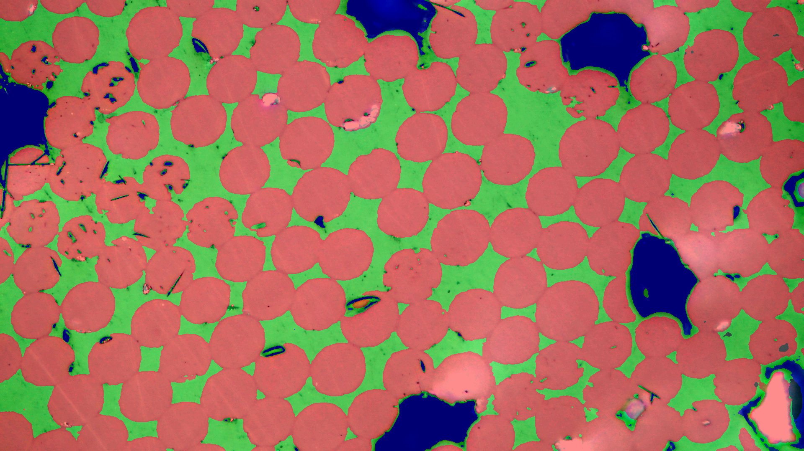
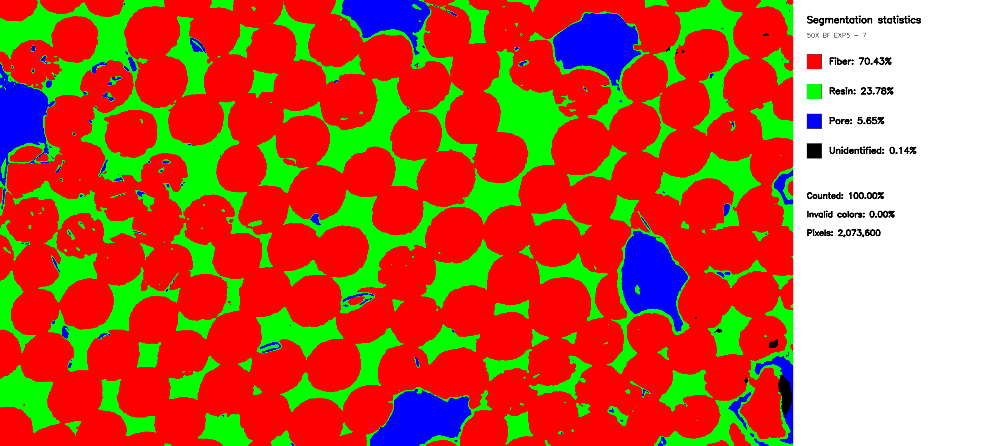

# Fiberglass micrograph segmentation

> **Turning microscopic structure into measurable material insight.**

This project trains a semantic-segmentation model to read fiberglass
micrographs at the pixel level: separating **fiber**, **resin**, and **pore**
regions from the visual texture of a composite. It takes the repetitive work
out of image-by-image inspection and produces masks, overlays, statistics, and
analysis reports from a repeatable command-line workflow.

<p align="center">
  
  
</p>

<p align="center">
  <em>Left: unprocessed source image. Right: model overlay — fiber in red, resin in green, and pore in blue.</em>
</p>

## Statistics, at a glance

<p align="center">
  
</p>

<p align="center"><em>Composition summary generated for the same sample.</em></p>

## At a glance

- **Label-aware training** — learns from painted masks where fiber is red,
  resin is green, pore is blue, and unidentified pixels are black.
- **End-to-end workflow** — validates annotations, trains a model, generates
  predictions, and produces statistics in one guided sequence.
- **Practical outputs** — creates segmentation masks, visual overlays, and
  analysis-ready reports for every image in a batch.

## Requirements and installation

You need Git and Python 3.10 or newer. The pinned dependencies use the CPU
build of PyTorch, so a GPU is not required.

```bash
git clone https://github.com/lolo-pb/opencv-testing.git
cd opencv-testing
python3 controller.py setup
```

On Windows, use `py` instead of `python3`. The setup command creates `.ven/`
and installs the packages from `requirements.txt`. Later controller commands
automatically use that environment, so you do not need to activate it.

## Run the pretrained model

The repository includes `checkpoints/final.pt`, the four-class checkpoint from
epoch 80. You can run inference immediately after installation; the private
training dataset is not required.

To segment one image:

```bash
python3 controller.py predict path/to/micrograph.jpg
```

To process all supported images directly inside a folder:

```bash
python3 controller.py predict path/to/images
```

With no path, the command reads from `predicting/images/`:

```bash
python3 controller.py predict
```

JPEG, PNG, BMP, TIFF, and WebP inputs are supported. Each prediction creates a
color mask and an overlay in `predicting/outputs/`.

Run `python3 controller.py` at any time to print the built-in command guide.

## Web interface

After installation, start the local web interface:

```bash
python3 web.py
```

Open <http://127.0.0.1:8000> and upload one micrograph. The page displays the
original image, exact-color mask, overlay, and percentages for fiber, resin,
pore, and unidentified pixels. The mask, overlay, and a one-row statistics CSV
can be downloaded from the results page.

The interface runs only on your computer. Uploaded images and generated
results are not retained or written to the project output folders. Each upload
is limited to 20 MiB and 25 megapixels.

## Windows desktop installer

The desktop release packages the existing web interface, the Python inference
backend, and the pretrained model into one Windows installer. After it is
installed, analysis runs locally and does not require Python or an internet
connection.

For a release build from Windows PowerShell, install Python 3.12 and Node 22,
then run from the project root:

```powershell
./scripts/build-windows.ps1
```

The installer is written to `desktop/release/`. The same installer is built by
the **Build Windows installer** GitHub Action: run it manually to download the
workflow artifact, or push a `v*` tag to attach it to a GitHub Release. The
first release is unsigned, so Windows may show a SmartScreen warning.

## Folders

- `training/images/`: original pictures used to train the model.
- `training/masks/`: same-name painted PNG masks. Fiber is red, resin is green,
  pore is blue, and unidentified pixels are black.
- `training/validated_masks/`: cleaned masks created by validation.
- `predicting/images/`: pictures to segment with a trained model.
- `predicting/outputs/`: generated masks, overlays, statistics, and charts.
- `checkpoints/`: trained model files shared by training and prediction.
- `common/`: shared Python code; do not run these files directly.

## Controller commands

```bash
python controller.py setup
python controller.py validate
python controller.py validate --with-overlays
python controller.py train
python controller.py train --with-overlays
python controller.py predict
python controller.py predict path/to/image-or-folder
python controller.py statistics
python controller.py analysis
python controller.py all
python controller.py all --with-overlays
python controller.py test
```

The examples use `python`; use the same Python launcher (`python3`, `python`, or
`py`) that you used during setup.

## Train your own model

Training data is not included. Add original micrographs to `training/images/`
and same-name painted PNG masks to `training/masks/`. Mask colors are red for
fiber, green for resin, blue for pore, and black for unidentified pixels.

Then validate and train:

```bash
python3 controller.py validate
python3 controller.py train
```

Training writes `checkpoints/latest.pt`, an intermediate checkpoint every five
epochs, and `checkpoints/final.pt`. These intermediate files remain ignored by
Git.

For the complete workflow, place prediction inputs in `predicting/images/`
and run:

```bash
python3 controller.py all
```

`all` validates the training data, trains a fresh model, predicts every input,
then creates statistics and analysis reports. It stops when a step fails. Add
`--with-overlays` when the training masks include corrected overlays.

## Advanced direct use

Use the configurable prediction script for its easy fixed defaults:

```bash
python -m predicting.predict_configurable predicting/images
```

Use `predict.py` when you want to choose the settings yourself:

```bash
python -m predicting.predict path/to/image.jpg \
  --checkpoint checkpoints/final.pt \
  --output-dir predicting/outputs \
  --tile-size 512 \
  --overlap 128
```

For advanced options on any script, use `python -m MODULE --help`, for example
`python -m training.train --help`.
